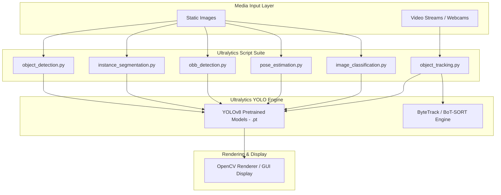
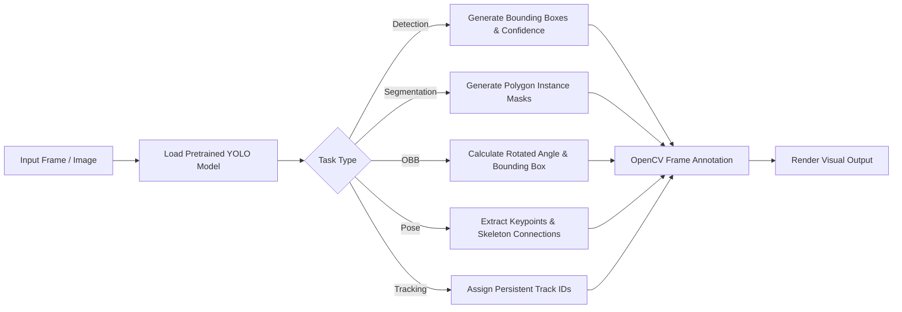

<div align="center">

# 🚀 Ultralytics YOLO All-In-One Demos

### End-to-End Computer Vision Suite for Detection, Segmentation, Pose, OBB & Tracking

[](https://www.python.org/)
[](https://docs.ultralytics.com/)
[](https://opencv.org/)
[](LICENSE)

*A streamlined, lightweight collection of production-ready Python scripts demonstrating the full capabilities of Ultralytics YOLO—covering Object Detection, Instance Segmentation, Pose Estimation, Oriented Bounding Boxes (OBB), Image Classification, and Real-Time Object Tracking.*

---

</div>

## 📖 Detailed Project Overview

**Ultralytics YOLO All-In-One Demos** provides a clean, modular starting point for developers, researchers, and computer vision engineers looking to deploy **YOLOv8** across a variety of visual tasks[cite: 8].

Instead of dealing with complex, bloated codebases, this repository isolates each core computer vision task into a standalone, easy-to-understand script powered by **Ultralytics** and **OpenCV**[cite: 8]. Whether you need to track objects in a video feed, detect rotated objects via Oriented Bounding Boxes (OBB), segment instance masks, or estimate human poses, this repository provides immediate out-of-the-box execution[cite: 8].

---

## ✨ Features Section

* **📦 Object Detection (`object_detection.py`)**: Real-time bounding box prediction and class labeling[cite: 8].
* **✂️ Instance Segmentation (`instance_segmentation.py`)**: Pixel-level object mask generation and boundary detection[cite: 8].
* **📐 Oriented Bounding Box Detection (`obb_detection.py`)**: Rotated bounding box predictions ideal for aerial, satellite, and angled object tracking[cite: 8].
* **🏃 Pose Estimation (`pose_estimation.py`)**: Human keypoint detection and skeletal landmark tracking[cite: 8].
* **🏷️ Image Classification (`image_classification.py`)**: High-accuracy category and top-K class classification[cite: 8].
* **🎯 Real-Time Object Tracking (`object_tracking.py`)**: Multi-object persistent ID tracking integrated with OpenCV video streaming[cite: 8].

---

## 🏗️ GitHub-Compatible Mermaid Architecture Diagram



---

## 🔄 Pipeline Execution Diagram



---

## 📊 Feature Matrix

| Feature | Computer Vision Task | Target Model | Real-time Video Support |
| :--- | :--- | :--- | :---: |
| **`object_detection.py`** | Object Bounding Box Detection | `yolov8n.pt` | ✅[cite: 8] |
| **`instance_segmentation.py`** | Pixel-Level Instance Segmentation | `yolov8n-seg.pt` | ✅[cite: 8] |
| **`obb_detection.py`** | Rotated / Oriented Bounding Boxes | `yolov8n-obb.pt` | ✅[cite: 8] |
| **`pose_estimation.py`** | Keypoint / Skeleton Pose Estimation | `yolov8n-pose.pt` | ✅[cite: 8] |
| **`image_classification.py`** | Whole-Image Classification | `yolov8n-cls.pt` | ✅[cite: 8] |
| **`object_tracking.py`** | Multi-Object ID Tracking | `yolov8n.pt` | ✅[cite: 8] |

---

## ⚡ Tech Stack

* **Core Computer Vision Engine**: [Ultralytics YOLOv8](https://docs.ultralytics.com/)

* **Language**: Python 3.8+


* **Image & Video Processing**: [OpenCV (`opencv-python`)](https://opencv.org/)

* **Tracking Library**: `lapx` (Linear Assignment Problem solver for tracking algorithms)


---

## 📂 Complete Project Structure

```text
ultralytics-yolo-all-in-one-demos/
├── image_classification.py       # Image classification demo script[cite: 8]
├── instance_segmentation.py      # Instance segmentation mask demo script[cite: 8]
├── obb_detection.py              # Oriented bounding box (rotated) demo script[cite: 8]
├── object_detection.py           # Standard object detection demo script[cite: 8]
├── object_tracking.py            # Real-time multi-object tracking demo script[cite: 8]
├── pose_estimation.py            # Human pose keypoint estimation demo script[cite: 8]
└── requirements.txt              # Core python dependencies[cite: 8]

```

---

## 🚀 Installation & Usage

### Setup Environment

1. **Clone the repository**:
```bash
git clone [https://github.com/your-username/ultralytics-yolo-all-in-one-demos.git](https://github.com/your-username/ultralytics-yolo-all-in-one-demos.git)
cd ultralytics-yolo-all-in-one-demos

```


2. **Create a virtual environment**:
```bash
python -m venv venv
source venv/bin/activate  # On Windows: venv\Scripts\activate

```


3. **Install required dependencies**:
```bash
pip install -r requirements.txt

```


---

### Running the Demos

Each script can be run directly. Weights will automatically download on the first run via Ultralytics:

* **Object Detection**:
```bash
python object_detection.py

```


* **Instance Segmentation**:
```bash
python instance_segmentation.py

```


* **Oriented Bounding Boxes (OBB)**:
```bash
python obb_detection.py

```


* **Pose Estimation**:
```bash
python pose_estimation.py

```


* **Object Tracking**:
```bash
python object_tracking.py

```


* **Image Classification**:
```bash
python image_classification.py

```


---

## ⚙️ Configuration

You can easily adjust the confidence thresholds, model sizes, and source inputs by opening any script and modifying the parameters:

| Parameter | Default Value | Description |
| --- | --- | --- |
| `model` | `yolov8n.pt` / variant | Path or model name (`n`, `s`, `m`, `l`, `x` variants) |
| `source` | `0` / `path/to/media` | Video/image input source (`0` for primary webcam) |
| `conf` | `0.25` | Minimum confidence score threshold for predictions |
| `iou` | `0.7` | Intersection Over Union (IoU) threshold for NMS |

---

## 🛣️ Future Improvements

* [ ] Add CLI argument parser (`argparse`) to all scripts for easy command-line configuration.
* [ ] Add TensorRT and ONNX export integration benchmarks.
* [ ] Include RTSP streaming and multi-camera threading support examples.

